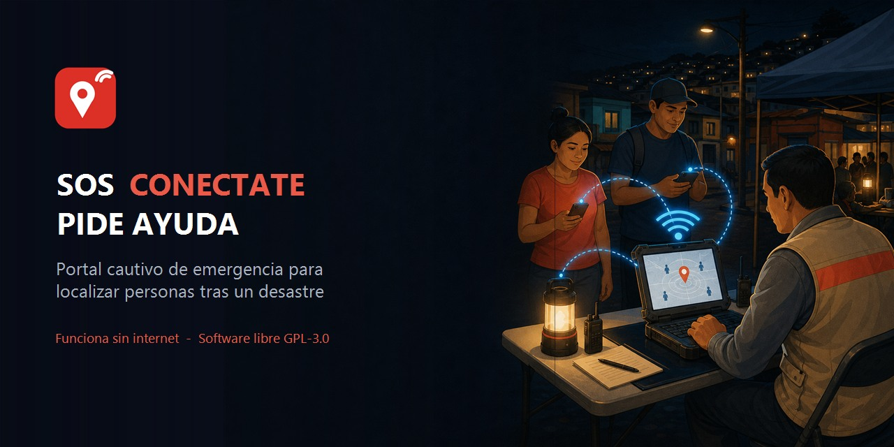
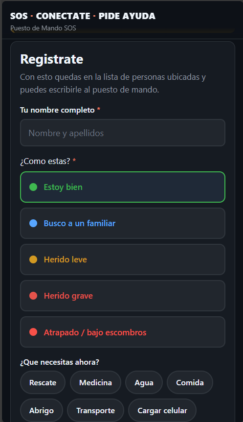
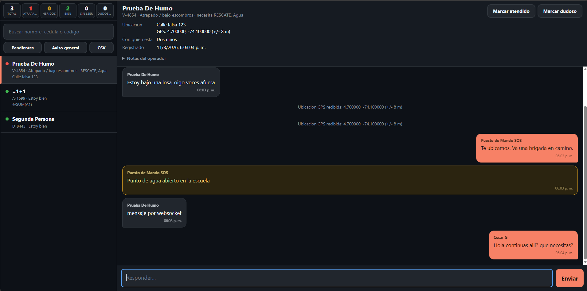
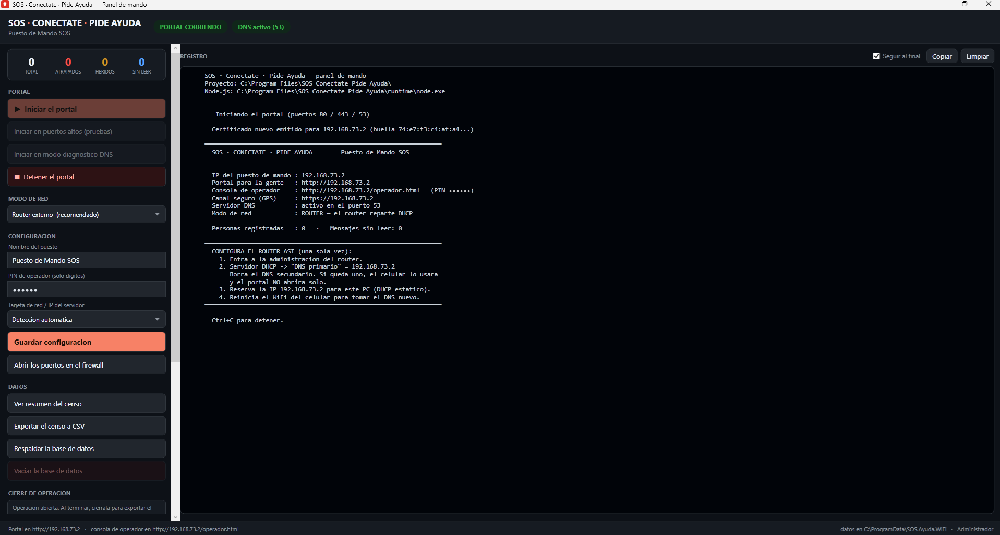

# SOS · Conéctate · Pide Ayuda



[](LICENSE)
[](CHANGELOG.md)
[](pruebas/humo.js)
[](https://github.com/cagd-dev/SOS.Ayuda.WiFi/releases)

**Portal cautivo de emergencia para localizar personas después de un desastre
—terremoto, inundación, derrumbe— cuando no hay internet ni cobertura celular.**

Se despliega un router WiFi abierto; cuando alguien se conecta, **se le abre solo**
un formulario donde se registra (censo de damnificados) y puede chatear con el
puesto de mando. Quien está atrapado o herido sube automáticamente al tope de la
lista del operador.

**Funciona 100 % sin internet.** Todo vive en la red local: servidor DNS, servidor
DHCP, base de datos y chat, en el mismo PC.

<sub><i>Offline emergency captive portal for disaster response: a self-contained
WiFi sign-in page that registers missing and trapped people and connects them to
an incident command post. No internet required. Spanish UI, GPL-3.0.</i></sub>

> Nació tras el terremoto de Colombia de agosto de 2026. Es **software libre
> (GPL-3.0)** y el código se distribuye sin ofuscar a propósito: si lo necesitas
> para una emergencia, cógelo, léelo y adáptalo. La GPL está elegida a
> conciencia: quien lo mejore y lo distribuya tiene que publicar sus cambios, de
> modo que las mejoras vuelvan a quien las necesite.

**Empezar:** [guía de despliegue](DESPLIEGUE.md) ·
[cómo contribuir](CONTRIBUIR.md) ·
[registro de cambios](CHANGELOG.md) ·
[componentes de terceros](TERCEROS.md)

---

## Descargar y usar (no hace falta programar)

Ve a **[Versiones (Releases)](https://github.com/cagd-dev/SOS.Ayuda.WiFi/releases)**
y baja uno de los dos:

| Archivo | Para qué |
|---|---|
| **`SOS.Conectate.PideAyuda-Setup.exe`** | Instalador para Windows. Es el que quieres. |
| **`SOS.Conectate.PideAyuda.zip`** | Versión portátil, para llevar en una USB. |

**No necesitas instalar Node.js, ni .NET, ni nada más:** viajan dentro del paquete.
Instala, abre **SOS Panel de mando**, pulsa *Iniciar el portal* y sigue la
[guía de despliegue](DESPLIEGUE.md).

> Windows va a avisar de que el programa no está firmado (SmartScreen). Es
> esperado: firmar cuesta dinero y este proyecto no vende nada. Si prefieres no
> fiarte de un binario —y haces bien—, el código está entero aquí y se compila con
> `.\empaquetar\construir.ps1 -Instalador`.

```
Celular ──WiFi──> Router comercial ──LAN──> Servidor (este proyecto)
                  DHCP anuncia DNS = IP del servidor
                       │
                       ├─ DNS   :53   responde TODO con la IP del servidor
                       ├─ HTTP  :80   intercepta las sondas de Android/iOS/Windows
                       │               y dispara el portal cautivo
                       ├─ HTTPS :443  canal cifrado: GPS y consola de operador
                       └─ WS          chat en vivo (con respaldo por polling)
```

👉 **Para desplegarlo léete [DESPLIEGUE.md](DESPLIEGUE.md).** Esto de aquí es la
documentación técnica.

---

## Así se ve

**Lo que ve la persona.** Se le abre solo al conectarse al WiFi. Nombre, cómo
está y qué necesita: tres respuestas y ya está en el censo. Botones grandes y
fondo oscuro, pensado para manos temblando y pantallas rotas.



**El puesto de mando.** La lista se ordena sola por urgencia — atrapados y
heridos graves arriba, atendidos al fondo — y desde la ficha se responde por
chat, se marca atendido o se marca como reporte dudoso.



**El panel de mando.** Trae **la consola de operador embebida**: se instala, se
pulsa *Iniciar el portal* y ya se está trabajando, sin salir a buscar un navegador
ni recordar una dirección. Todo lo demás —arrancar, configurar, exportar, cerrar la
operación— vive en un cajón que se abre con un solo botón y se recoge solo cuando
el portal arranca.



<sub>La captura es de la versión 1.2.0, cuando el panel mostraba el registro del
servidor. Hoy ese registro es una pestaña más.</sub>

> Las capturas son de una prueba con datos inventados. El PIN va tapado y la
> coordenada GPS es sintética: nunca publiques capturas de una operación real.

---

## Distribuir

```powershell
.\empaquetar\construir.ps1 -Instalador
```

Deja en `empaquetar/salida/`:

| Entregable | Tamaño | Para qué |
|---|---|---|
| `SOS.Conectate.PideAyuda-Setup.exe` | 80 MB | Instalador. No requiere Node, .NET ni nada más |
| `SOS.Conectate.PideAyuda.zip` | 91 MB | Versión portátil, para una USB |

**Node viaja dentro** (`runtime/node.exe`), y el panel lo prefiere sobre el que
haya instalado en el equipo. **El JavaScript viaja sin empaquetar ni ofuscar**, a
propósito: cualquiera tiene que poder leerlo, auditarlo y adaptarlo a su
emergencia.

Si distribuyes una versión modificada, la GPL-3.0 te obliga a publicar el código
de tus cambios. Ver [LICENSE](LICENSE) y [TERCEROS.md](TERCEROS.md).

El script se autocomprueba: antes de comprimir, ejecuta `tools/estado.js` con el
Node empaquetado y falla si no responde. Así no se publica un paquete roto.

Los binarios **no viven en el repositorio**, van en las Releases de GitHub. El
procedimiento completo está en [empaquetar/PUBLICAR.md](empaquetar/PUBLICAR.md).

## Arranque rápido (desde el código)

Para operar no hace falta nada de esto — usa el instalador. Esto es para
desarrollar. Necesitas **Node.js 22.5+** y, para el panel, el **SDK de .NET 8**.

**Doble clic en `ARRANCAR.bat`.** Se autoeleva, instala dependencias la primera vez,
libera el puerto 53, aplica las reglas de firewall y abre el **panel de mando**
(`panel/publicado/PanelSOS.exe`), desde donde se hace todo: arrancar, cambiar el PIN,
exportar el censo, respaldar, vaciar, diagnosticar.

`CONSOLA.bat` abre el mismo conjunto de acciones como **menú de texto**, para
escritorio remoto lento o si .NET no está disponible.

Equivalentes por línea de comandos:

| Comando | Para qué |
|---|---|
| `npm run consola` | La consola de administración (sin la preparación del `.bat`) |
| `npm start` | Levanta el sistema en los puertos 80 y 53 |
| `npm run puertos-altos` | Igual, pero en 8080/8443/5354 (no necesita Administrador) |
| `npm run dev` | Con recarga automática al editar |
| `npm run diagnostico` | Chequeo previo al despliegue |
| `npm run prueba` | 127 pruebas end-to-end contra el servidor corriendo |
| `npm run prueba-cierre` | 27 pruebas del cierre de operación (no necesita el servidor) |
| `npm run limpiar` | Respalda y vacía la base (con el servidor detenido) |

---

## Cómo funciona el portal cautivo

Todos los sistemas operativos preguntan "¿esta red tiene internet?" pidiendo una
URL conocida y comparando la respuesta:

| Sistema | Pide | Espera |
|---|---|---|
| Android | `connectivitycheck.gstatic.com/generate_204` | `204` vacío |
| iOS / macOS | `captive.apple.com/hotspot-detect.html` | HTML con `Success` |
| Windows | `www.msftconnecttest.com/connecttest.txt` | `Microsoft Connect Test` |
| Firefox | `detectportal.firefox.com/success.txt` | `success` |

El truco son **dos piezas trabajando juntas**:

1. [`src/dns.js`](src/dns.js) responde **cualquier** dominio con la IP del servidor.
   Así la sonda no llega a Google ni a Apple: llega a nosotros.
2. [`src/http.js`](src/http.js) contesta esas rutas con un **302** hacia el portal.
   Como la respuesta no es la esperada, el sistema concluye "hay portal cautivo" y
   abre la ventana de registro él solo.

Detalles que importan y por los que fallan otras implementaciones:

- El DNS responde **A** con nuestra IP, pero **AAAA (IPv6) vacío sin error**. Si
  devolviera error, algunos Android se cuelgan en vez de caer a IPv4.
- El redirect es catch-all por `Host`: cubre las sondas conocidas *y* cualquier
  dominio que la gente teclee a mano.
- Si el router reparte un DNS secundario, el celular lo usa y nada de esto ocurre.

---

## Estructura

```
src/
  ajustes.js   Lee y escribe datos/configuracion.json (PIN, puesto, IP)
  cierre.js    Cierre de operación: cerrar, entregar, purgar, constancia
  config.js    Detección de IP LAN (descarta VMware/Hyper-V/VPN), puertos, PIN
  db.js        SQLite: personas, mensajes, eventos. Cálculo de urgencia.
  dhcp.js      Servidor DHCP para el modo punto de acceso propio (RFC 2131)
  dns.js       Servidor DNS escrito a mano sobre dgram
  http.js      Express: intercepción de sondas, API pública y API de operador
  puntoacceso.js  Levanta el WiFi con la tarjeta del equipo y dice si puede
  red.js       Identifica el teléfono por su MAC leyendo la tabla ARP
  tls.js       Certificado autofirmado para el canal del GPS
  ws.js        Chat en tiempo real
  server.js    Arranque, banner con instrucciones del router, apagado limpio
public/
  index.html      Portal de registro (el censo)
  chat.html       Chat de la persona
  ubicacion.html  Página del canal HTTPS que pide el GPS
  operador.html   Consola del puesto de mando
  cartel.html     Cartel imprimible con el nombre de la red
  js/gps-enlace.js  Explicación previa al aviso de certificado (portal y chat)
pruebas/
  humo.js        127 pruebas end-to-end
  cierre.js      27 pruebas del cierre, contra una carpeta temporal
  diagnostico.js Chequeo previo al despliegue
tools/
  cierre.js        Cierre de operación por línea de comandos
  consola.js       Menú de texto (respaldo del panel)
  estado.js        Estado del sistema en JSON, para el panel
  exportar-csv.js  Censo a CSV
  punto-acceso.js  ¿Puede esta tarjeta ser punto de acceso? Veredicto y motivo
  respaldar.js     Copia de la base con fecha
  reiniciar-bd.js  Respalda y vacía la base
panel/
  PanelSOS.csproj  Panel de mando en WPF (net8.0-windows)
  MainWindow.xaml  Ventana: consola embebida, cajón de ajustes y registro
  Servicios.cs     Localizar el proyecto, lanzar Node, leer estado
```

### El panel no reimplementa la lógica

El panel de WPF es **una carcasa cómoda, no un segundo sistema**. Cada botón llama
al mismo script de Node que usa el menú de texto, y lee el estado de
`tools/estado.js`. No hay una copia de las reglas en C# que se pueda desincronizar
con la de JavaScript.

La zona principal es **la consola de operador dentro de un WebView2**: la misma
página que se sirve por HTTP, no una reimplementación en C#. El registro del
servidor sigue estando, en su pestaña, porque el portal corre como **proceso hijo
del panel con la salida redirigida**. Esa fue la razón de ser del panel: antes el
portal se abría en una consola aparte que saltaba al frente y le robaba el teclado
a quien estuviera escribiendo.

Si el equipo no tiene el runtime de WebView2, el panel **no se rompe**: lo detecta y
ofrece abrir la consola en el navegador del sistema. Quedarse sin consola en mitad
de una emergencia no puede depender de un componente opcional de Windows.

### Cero dependencias nativas

Tres paquetes, todos JavaScript puro: `express`, `ws` y `selfsigned` (este último
solo se usa una vez, al emitir el certificado). La base de datos usa
**`node:sqlite`**, que viene dentro de Node 22.5+. Esto es deliberado: en terreno no
vas a poder compilar módulos nativos ni bajar paquetes.

---

## Modelo de datos

**Estados** y su peso de urgencia (la consola ordena sola por esto):

| Estado | Urgencia |
|---|---|
| `atrapado` | 4 |
| `herido_grave` | 3 |
| `herido_leve` | 2 |
| `busca` (busca un familiar) | 1 |
| `bien` | 0 |

Se suma extra si la persona pidió `rescate` (+2) o `medicina` (+1). Quien ya fue
marcado como atendido baja al fondo de la lista.

**Necesidades:** `agua`, `comida`, `medicina`, `abrigo`, `rescate`, `transporte`, `carga`.

Cada persona recibe un **código pronunciable** tipo `A-4821` (sin letras I ni O,
que se confunden con 1 y 0). Sirve para gritarlo por altavoz y para que la persona
recupere su sesión si se le cierra la ventana.

---

## API

### Pública (la persona)

| Método | Ruta | Qué hace |
|---|---|---|
| `GET` | `/api/config` | Nombre del puesto, estados y necesidades disponibles |
| `POST` | `/api/registro` | Registra a la persona, devuelve token y código |
| `POST` | `/api/recuperar` | Recupera sesión con código + nombre |
| `GET` | `/api/yo` | Datos de la sesión actual |
| `POST` | `/api/yo` | Actualiza estado, necesidades y ubicación |
| `GET` | `/api/mensajes?desde=N` | Mensajes nuevos (carril de respaldo del WS) |
| `POST` | `/api/mensajes` | Envía mensaje |
| `POST` | `/api/ubicacion` | Coordenadas GPS. **Solo se puede usar desde el canal HTTPS** |
| `GET` | `/api/directorio?q=` | Tablón público: solo nombre, código y estado |

| `GET` | `/api/reconocer` | ¿Conocemos este teléfono? Devuelve nombre y código, no el token |
| `POST` | `/api/reconocer` | Confirma y entrega la sesión |

La sesión es un token de 32 caracteres, en cookie **y** en `localStorage`, y
aceptado también por query `?t=`. Los tres caminos existen porque el mini-navegador
del portal cautivo **no comparte cookies ni almacenamiento con el navegador real**:
si la persona salta de uno a otro, el token viaja en el enlace.

### Cuando se pierden cookie, token y código

Hay un cuarto camino, que es el que salva a quien no anotó su código y perdió la
ventanita: **identificar el teléfono por su MAC**, leída de la tabla ARP
([red.js](src/red.js)).

Funciona porque la MAC no vive en el navegador sino en el aparato, así que
sobrevive el salto del mini-navegador a Chrome. Y aunque iOS y Android aleatorizan
la MAC por privacidad, lo hacen **una vez por red**: dentro de nuestro WiFi es
estable, que es exactamente lo que necesitamos.

Decisiones alrededor:

- **Se pregunta, no se entra solo.** `GET /api/reconocer` devuelve nombre y código
  pero **nunca el token**; la sesión solo se entrega tras confirmar con el `POST`.
  Un mismo teléfono lo pueden haber usado dos personas distintas.
- **La IP se compara como token completo**, no con `includes()`. `172.19.199.1` es
  subcadena de `172.19.199.117`, y equivocarse ahí significaría entregarle a alguien
  la sesión de otro. Hay una prueba con una tabla ARP real que lo verifica.
- **Si falla, no pasa nada.** Sin MAC disponible el sistema sigue funcionando con
  cookie, token y código como antes.

**Límite conocido:** quien esté en esta misma red puede falsificar una MAC y hacerse
pasar por otra persona. En una red abierta de emergencia se asume ese riesgo a cambio
de que nadie pierda su sesión.

### Operador (requiere PIN)

`POST /admin/login` devuelve una sesión que va en la cookie `sos_op` o en la
cabecera `X-SOS-Sesion`. Las sesiones viven en memoria: al reiniciar el servidor
hay que volver a entrar.

| Método | Ruta | Qué hace |
|---|---|---|
| `GET` | `/admin/api/personas` | Lista completa ya priorizada, con no leídos |
| `GET` | `/admin/api/personas/:id` | Ficha + hilo de mensajes |
| `POST` | `/admin/api/personas/:id/mensajes` | Responder |
| `POST` | `/admin/api/personas/:id/atendido` | Marcar atendido / reabrir |
| `POST` | `/admin/api/personas/:id/dudoso` | Marca/desmarca reporte dudoso (motivo obligatorio) |
| `POST` | `/admin/api/personas/:id/notas` | Notas internas |
| `POST` | `/admin/api/difusion` | Aviso general a todos |
| `GET` | `/admin/api/exportar.csv` | Censo completo para las autoridades |

---

## Configuración

Lo que el operador cambia en terreno vive en **`datos/configuracion.json`**, escrito
por la consola de administración: `pin`, `puesto`, `bienvenida`, `ip`. No hay que
editar ningún `.bat` ni recordar variables.

El orden de precedencia es **flag de línea de comandos → variable de entorno →
`configuracion.json` → valor por defecto**. Así una prueba puntual puede sobrescribir
la configuración con `SOS_PIN=9999 npm start` sin tocar el archivo, y el archivo
gobierna en la operación normal.

El servidor además escribe **`datos/servidor.json`** mientras corre (PID y puertos
reales). La consola lo usa para saber si el portal está arriba: preguntar por "el
puerto 80" daría un falso negativo si arrancó en puertos altos. Si el proceso muere
de golpe, el archivo queda huérfano y la consola lo detecta comprobando que el PID
siga vivo, y lo limpia.

### Variables de entorno

| Variable | Default | Para qué |
|---|---|---|
| `SOS_PIN` | aleatorio | PIN de la consola. Se genera de seis dígitos en el primer arranque; esta variable solo sirve para forzarlo en pruebas |
| `SOS_IP` | autodetectada | Fuerza la IP si hay varias tarjetas |
| `SOS_PUERTO_HTTP` | `80` | Puerto del portal |
| `SOS_PUERTO_DNS` | `53` | Puerto del DNS |
| `SOS_PUERTO_HTTPS` | `443` | Puerto del canal seguro del GPS |
| `SOS_DNS` | `1` | `0` apaga el DNS (el portal ya no abre solo) |
| `SOS_HTTPS` | `1` | `0` apaga el canal seguro (el GPS deja de funcionar) |
| `SOS_PUESTO` | `Puesto de Mando SOS` | Nombre que ve la gente |
| `SOS_BIENVENIDA` | — | Texto de bienvenida del portal |
| `SOS_HOST` | `sos.ayuda` | Nombre amigable. **Nunca uses `.local`**: los iPhone lo resuelven por mDNS y se saltan nuestro DNS. |
| `SOS_ADMIN_HTTP` | — | `1` deja la consola de operador accesible **también sin cifrar**. Válvula de escape para un equipo donde no haya forma de aceptar el aviso del certificado. |

Equivalentes por línea de comandos: `--ip`, `--http`, `--dns`, `--https`, `--sin-dns`,
`--sin-https`, `--dns-verboso`.

---

## Decisiones de diseño

**Dos carriles para el chat.** WebSocket cuando se puede, polling cada 3 s cuando
no. El mini-navegador del portal cautivo bloquea WebSockets con frecuencia, sobre
todo en iOS, y una red saturada mata conexiones sin avisar. El indicador de la
cabecera dice en cuál de los dos está.

**El formulario funciona sin JavaScript.** Hace POST nativo y el servidor responde
HTML. Hay portales cautivos viejos donde el JS no corre.

**Enter envía llamando a la función de envío, no a `form.requestSubmit()`.** Ese
método no existe en Safari anterior al 16, y ahí el Enter se quedaba mudo sin dar
ninguna señal. Se ignora además el Enter que llega con `isComposing` o `keyCode 229`,
que es el que cierra un acento o una diéresis.

**El portal arranca en su propia ventana desde la consola de administración.**
Antes corría dentro del menú y lo bloqueaba: para volver al menú había que detener
el portal, lo que hacía imposible correr la prueba de humo, que necesita el portal
arriba. El menú confirma el arranque esperando a que aparezca `datos/servidor.json`
en vez de decir "listo" a ciegas.

**El puerto alto del DNS es el 5354, no el 5353.** El 5353 es el de mDNS/Bonjour,
que viene instalado con iTunes y otros: el DNS no arrancaba y el fallo se
manifestaba como tres pruebas en timeout, que apuntaban al sitio equivocado.

**Dos protocolos, cada uno para lo suyo.** El portal vive en HTTP porque la
detección de portal cautivo lo exige: las sondas son HTTP y hay que contestarlas.
Pero los navegadores solo entregan el GPS en contexto seguro. La solución es un
canal HTTPS paralelo con certificado autofirmado emitido para la IP del puesto.

Por ese canal cifrado va también **la consola de operador**: ahí viajan el PIN,
la sesión y los datos de las víctimas, y esta red es abierta. La diferencia está
en a quién se le puede pedir que acepte un aviso de certificado: **al operador
sí, a alguien atrapado no**. Por eso el portal de la gente se queda en HTTP.

**Y no es una recomendación, es la única puerta.** Cuando el canal cifrado está
arriba, el plano de administración *solo* existe ahí: `/operador.html` por HTTP
redirige, `/admin/*` responde 403 y el WebSocket de operador sin cifrar se
cierra. Ofrecer HTTPS dejando HTTP abierto "por si acaso" no impone nada: basta
teclear la dirección sin la ese —de memoria, de un marcador viejo— para que el
PIN viaje en claro sin que nadie se entere.

Las tres puertas se cierran juntas a propósito: la que quedara abierta anularía
a las otras dos.

Dentro del panel de mando no se ve ningún aviso, porque WebView2 acepta el
certificado explícitamente.

**Si el canal cifrado NO está arriba, todo sigue por HTTP.** Esa parte no se
negocia: quedarse sin consola en mitad de una emergencia es peor que cualquier
escucha. Y `SOS_ADMIN_HTTP=1` fuerza el modo antiguo, por si aparece un equipo
donde no haya forma de aceptar el certificado.

> **Alcance honesto:** esto protege del descuido y de la captura pasiva, que es
> el ataque realista en un WiFi abierto. No protege contra un intermediario
> activo: quien controle la red puede quitar la redirección, y un certificado
> autofirmado que se acepta a mano puede ser sustituido por otro. Sube el
> listón, no cierra la puerta.

Detalles que hacen que funcione:

- El certificado lleva la IP en **subjectAltName**. Sin eso, los navegadores
  modernos rechazan la conexión sin ofrecer siquiera el botón de continuar: hace
  años que ignoran el `commonName`. Hay una prueba de humo que lo verifica.
- Se regenera solo si cambia la IP del puesto, porque un certificado emitido para
  otra IP produce ese mismo rechazo sin salida.
- **La explicación va antes de abrir la ventana**, con una maqueta del aviso y los
  pasos exactos por navegador ([gps-enlace.js](public/js/gps-enlace.js)). Sin esa
  pantalla la gente ve la advertencia roja y se devuelve.
- El paso de GPS ocurre **después del registro**, nunca antes. La persona ya está
  en el censo — lo importante — y el GPS solo enriquece. Si abandona en el aviso
  del certificado, no se pierde nada.
- Al reenviar coordenadas se **reemplaza** la línea `GPS:` anterior en vez de
  apilarla, pero se conserva la dirección que la persona escribió a mano.

**Interfaz para condiciones de mierda.** Fondo oscuro (ahorra batería en OLED y no
encandila de noche), botones de 56 px mínimo (manos temblando, pantallas rotas),
contraste alto (se usa a pleno sol).

**WAL + `synchronous = FULL` en SQLite.** Si se va la luz de golpe, no se pierde
el censo.

**Nada de sincronización entre puntos.** Cada punto es autónomo; los CSV se juntan
al final. Lo simple es lo que no se cae.

**El aviso de uso responsable aparece en cuatro sitios.** No se puede impedir que
alguien mienta, pero sí que nadie pueda decir que no sabía para qué era esto:

1. Bloque destacado **antes** del formulario, en el portal.
2. Declaración pegada al botón de envío (`Es verdad · Registrarme`), donde se lee
   justo antes de pulsar y no tres pantallas más arriba.
3. Mensaje de sistema al abrir el chat, para que la regla viaje **dentro de la
   conversación** y no se quede en una pantalla que ya pasó.
4. Línea permanente sobre el cuadro de escritura, siempre visible.

Más el bloque en negro del cartel impreso, que se lee antes de conectarse.

El argumento que se usa no es la amenaza sino el costo para terceros: *un reporte
falso desvía una brigada y le quita el turno a alguien atrapado de verdad*. Y se
dice, porque es cierto, que todo queda registrado con fecha, hora y dispositivo, y
que el censo se entrega a las autoridades.

**El reporte dudoso baja de prioridad, nunca borra.** El operador marca con un
motivo obligatorio, y queda registrado quién lo marcó y cuándo. El orden queda:
casos normales por urgencia → dudosos → atendidos. Tres decisiones detrás:

- **No se borra** porque en una emergencia la sospecha se equivoca a menudo, y lo
  que hoy parece broma mañana puede ser el único rastro de alguien.
- **El motivo es obligatorio** para que el operador tenga que articular la sospecha
  en vez de bajar a alguien por corazonada.
- **La persona nunca ve la marca.** Si la viera, el operador dejaría de usar la
  herramienta por miedo al conflicto — y perderíamos el triaje justo cuando hace falta.

`vistaPersona()` en [db.js](src/db.js) es lo que garantiza ese último punto: quita
`notas`, `dudoso*`, `ip` y `agente` de todo lo que sale hacia la persona, tanto por
HTTP como por WebSocket. Hay pruebas de humo dedicadas a que eso no se rompa.

---

## Lo que este sistema NO hace

Que quede claro para no prometer de más:

- **No manda mensajes fuera de la red.** No hay SMS, ni WhatsApp, ni correo. Sirve
  para hablar con el puesto de mando y dejar constancia de que alguien está vivo
  y dónde.
- **No cifra el portal ni el chat.** Van en HTTP sobre WiFi abierto. En emergencia
  el intercambio vale la pena, pero la gente no debe escribir contraseñas ahí. El
  canal HTTPS existe solo para desbloquear el GPS, y al ser autofirmado **no
  protege contra alguien malicioso dentro de la misma red**: no lo vendas como
  "seguro" en sentido estricto.
- **No aguanta multitudes.** 20-40 celulares por router doméstico. Para más, más
  puntos.
- **No reemplaza al sistema oficial.** Es un puente mientras las comunicaciones
  vuelven. Los datos se entregan a Defensa Civil / Cruz Roja / UNGRD.

---

## Si llegaste buscando otra cosa

Esto es lo que la gente suele estar buscando cuando termina aquí, por si es tu caso
o por si conoces a quien lo necesita:

**En español** — portal cautivo sin internet · censo de damnificados · localizar
personas después de un terremoto · red WiFi de emergencia · chat con puesto de
mando · registro de desaparecidos · comunicación en desastres sin cobertura ·
sistema de emergencia offline · punto de encuentro digital · albergue temporal.

**In English** — offline captive portal · disaster response software · emergency
WiFi network · missing persons registry · earthquake response tools · incident
command post chat · humanitarian software · no-internet communication · shelter
check-in system · SAR (search and rescue) support.

Está escrito **en español** a propósito: se diseñó para una emergencia en Colombia y
la gente que lo usa bajo presión lee en español. Si lo necesitas en otro idioma,
[las traducciones son bienvenidas](CONTRIBUIR.md) — los textos están en
`public/*.html` y en `public/js/`.
